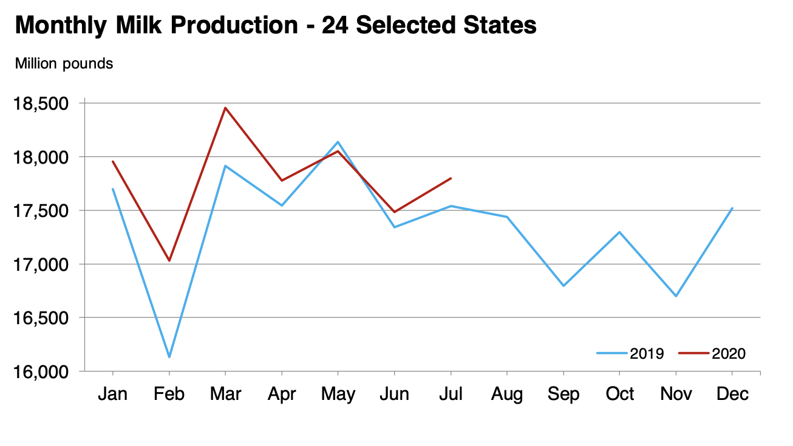

# Let's upgrade the visualizations found in the following milk report
- https://downloads.usda.library.cornell.edu/usda-esmis/files/h989r321c/wh247f512/tq57pd47k/mkpr0820.pdf
    - consulted 9/10/2020, 1:45 pm EST

**For now we won't worry about the information described in the text. We'll just focus on the visualizations**

## Monthly Milk Production - 24 Selected States

## TOC
Table of Contents
- **1.0-EDA.ipynb** Exploratory data analysis
    - document data set download from quick stats (QS)
    - read data into pandas
    - **declutter data**
        - drop empty cols
        - **extract meta-data**
            - move non-varying columns into a metadata object
            - init null-sentinel handling
    - **split data by periodicity**
        - monthly
        - quarterly
        - annaul
    - validate data types
    - initial visualizations
